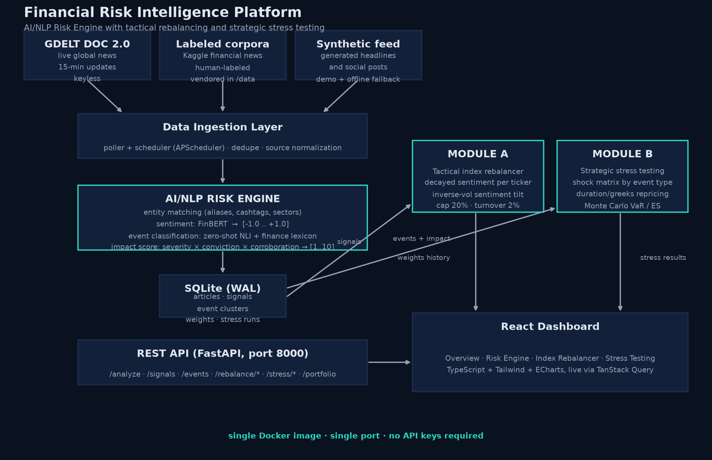

# Financial Risk Intelligence Platform - S&P Global & Crisil Campus Hackathon

**Candidate Name:** Sachin Goyal
**College Email ID:** [your_id@thapar.edu]
**College / Campus:** Thapar Institute of Engineering and Technology (TIET), Patiala
**Demo Video Link:** [YouTube / Unlisted]
**Slide Deck Link (if hosted externally):** [docs/presentation.pdf in this repo]

## 1. Project Overview / Problem Statement & Approach

Financial risk rarely announces itself in structured data. It surfaces first as text: a
news headline about sanctions, a tweet about a lender's spreads, a downgrade story that
has not reached the rating agencies' press releases yet. The case study asked us to
convert that unstructured stream into machine-readable risk intelligence, and to prove
it is useful by wiring it into at least one concrete downstream application.

The platform is built around a single AI/NLP Risk Engine. It ingests text from three
keyless sources (live GDELT news every 15 minutes, a vendored and attributed copy of the
Kaggle "Sentiment Analysis for Financial News" corpus, and a synthetic generator used for
demo volume and offline fallback), and produces three structured fields per item: a
sentiment score in [-1, 1] (FinBERT), an event classification (zero-shot NLI blended with
a finance-specific keyword lexicon), and a 1-10 impact score (an explainable composite of
event-type severity, sentiment extremity, and source corroboration). Related items merge
into event clusters within a 24-hour window, so a single headline can grow into a
high-impact event as more sources pick it up.

Both downstream modules are implemented. Module A is a tactical rebalancer for a 14-name
mock S&P 100 index: per-ticker sentiment enters as an inverse-volatility-scaled tilt on
the market-cap anchor, with a 20% per-name cap and 2% daily turnover. Module B is a
strategic stress-testing tool for a synthetic wholesale banking book (loans, bonds,
derivatives, equities): high-impact events (e.g. Geopolitical with impact > 7) trigger a
shock matrix, positions reprice with duration/convexity and greeks math, and a Monte
Carlo overlay reports a P&L distribution with 95% VaR and expected shortfall.

## 2. Architecture & Tech Stack



- **Engine:** Python 3.11, FastAPI, SQLAlchemy + SQLite (WAL mode), APScheduler
- **Models:** `ProsusAI/finbert` (sentiment), `typeform/distilbert-base-uncased-mnli`
  (zero-shot event classification); weights are baked into the Docker image at build time
- **Frontend:** React 18 + TypeScript + Tailwind + ECharts, served by the same FastAPI
  process (one port for UI and API)
- **Data flow:** sources → ingestion (dedupe, normalization) → NLP pipeline →
  signals/event clusters (SQLite) → Module A tick every 5 min and Module B trigger →
  REST API → dashboard

Design choices worth noting: the platform is **keyless by default** (GDELT and yfinance
need no credentials, models are local); every score is **explainable** (the impact score
decomposes into severity × conviction × corroboration); and the system **degrades but
never dies** (if GDELT or yfinance are unreachable, cached and synthetic data keep the
demo alive).

## 3. Dataset Used

- **Kaggle "Sentiment Analysis for Financial News"** (`data/seed/all-data.csv`,
  ~4,846 human-labeled financial headlines). Source: [Kaggle](https://www.kaggle.com/datasets/ankurzing/sentiment-analysis-for-financial-news);
  original corpus: Malo et al. (2014), "Good debt or bad debt: A semantic annotation
  study of financial news headlines". License: CC BY-NC-SA 4.0 as distributed on Kaggle.
  Used verbatim with attribution ([data/seed/ATTRIBUTION.md](data/seed/ATTRIBUTION.md))
  as a labeled evaluation corpus and historical demo news.
- **GDELT DOC 2.0 API** — live keyless global news feed, used at runtime (15-minute polls).
- **Synthetic generator** (`src/engine/ingest/synthetic.py`) — self-generated headlines
  and social posts for demo volume, offline fallback, and guaranteed high-impact events.
- **yfinance** — daily closes and market caps for the 14-ticker mock index (public data,
  disk-cached so the demo survives offline).
- **Synthetic portfolio** (`data/portfolio/portfolio.json`) — a fictional $3.9B wholesale
  banking book with 40 positions across loans, bonds, derivatives and equities.

Assumptions: event labels for the synthetic feed are generator-known; Kaggle headlines
carry no real timestamps, so the backfill spreads them over a 21-day demo window.

## 4. Quickstart & Installation

Runtime: **Python 3.11** (or Docker Desktop with 6 GB+ free RAM). Tested on Windows 11.

### Option A: Docker (recommended)

```bash
git clone <your-repo-url>
cd <repo-folder>
docker compose up --build
```

First build compiles the frontend and downloads model weights into the image
(~10 minutes with a typical connection; subsequent builds are cached). First start
runs a one-time backfill (~2-3 minutes on GPU-equipped machines, ~9 on CPU) and then:

- Dashboard: http://localhost:8000
- API docs: http://localhost:8000/docs

### Option B: local Python (no Docker)

```bash
git clone <your-repo-url>
cd <repo-folder>
python -m venv .venv
.venv/Scripts/pip install -r requirements.txt      # Linux/Mac: .venv/bin/pip
.venv/Scripts/python -m src.scripts.backfill       # one-time demo data bootstrap
.venv/Scripts/python -m uvicorn src.engine.main:app --port 8000
```

The frontend bundle is committed (`frontend/dist/`), so no Node toolchain is needed at
runtime. To rebuild it: `cd frontend && npm install && npm run build`.

Tests: `python -m pytest tests/ -q` (46 tests, hermetic, no model downloads).

Optional extras: fine-tuning (`pip install -r requirements-dev.txt` then
`python -m src.scripts.train_sentiment`), impact validation
(`python -m src.scripts.validate_impact`), strategy backtest
(`python -m src.scripts.backtest_rebalancer`).

## 5. Key Results & Domain Impact

- **Sentiment accuracy** on the labeled Kaggle corpus: see
  [docs/sentiment_metrics.json](docs/sentiment_metrics.json) (fine-tuned model;
  base FinBERT number in `data/cache/sentiment_eval_*.json`).
- **Impact validation** (event study): correlation between Impact Scores and realized
  1-day ticker moves — `data/cache/impact_validation.json`.
- **Strategy backtest**: sentiment-tilted index vs cap-weighted baseline over the demo
  window — `data/cache/rebalance_backtest.json`.
- The full pipeline (5,000+ items) completes in minutes on a laptop and every output is
  auditable: entity matched, sentiment, event type, and the impact breakdown.

**Domain impact:** desks and risk teams lose minutes-to-hours between news and
structured response. This platform shows the full path in one deployable artifact:
text in, risk signal out, positions re-tilted, book re-priced, and the P&L-at-risk
quantified with VaR/ES — the same workflow pattern (signal → scenario → capital view)
used in market-risk and ICAAP/CCAR-style stress testing, scaled to a hackathon build.

## Notes & Limitations

- The stress-test trigger rule is intentionally simple (Geopolitical, impact > 7) and the
  shock matrix is illustrative, not calibrated to regulatory scenarios.
- Impact validation over a 3-week demo window with synthetic history is illustrative;
  a production version would train/validate on years of aligned price data.
- GDELT provides headlines (no full body text); sentiment on headlines only is the
  industry-standard trade-off for latency.

## License

MIT — see [LICENSE](LICENSE).
