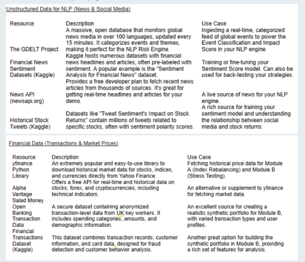

# Financial Risk Intelligence Platform --- Case Study

## 1. Problem Statement

The objective of this case study is to design and implement a platform
capable of ingesting and analyzing real-time, unstructured data to
generate actionable financial risk signals.

The primary deliverable is a unified **AI/NLP Risk Engine**. This engine
will serve as the central processing unit, responsible for parsing
text-based data from sources such as news feeds and social media, and
converting it into structured output.

Upon completion of the core engine, teams are required to implement **at
least one** of the following downstream modules to demonstrate a
practical application of the generated risk intelligence:

-   **Module A:** A tactical, high-frequency stock index rebalancer.
-   **Module B:** A strategic, event-driven portfolio stress-testing
    tool.

The project is structured modularly to allow for focused development on
distinct components within the specified timeframe.

------------------------------------------------------------------------

## 2. The Core Challenge: The AI/NLP Risk Engine

The primary task is to build a robust data pipeline and NLP model that
can ingest text from various sources and output structured,
machine-readable risk signals.

### Engine Requirements

#### Data Ingestion

The engine must be able to process text from at least **two different
sources**, for example:

-   Financial news articles
-   Twitter/X posts

#### NLP-Driven Analysis

For a given company or event, the engine must analyze the text and
output structured data containing the following fields:

  -----------------------------------------------------------------------
  Field                               Description
  ----------------------------------- -----------------------------------
  **Sentiment Score**                 A numerical score indicating
                                      positive, negative, or neutral
                                      sentiment, e.g. from **-1.0 to
                                      1.0**.

  **Event Classification**            A categorical label for the type of
                                      event discussed,
                                      e.g. **Geopolitical, Macroeconomic,
                                      Credit Event, Merger/Acquisition,
                                      Product Launch**.

  **Impact Score**                    A predicted severity score,
                                      e.g. **1--10**, indicating the
                                      potential market impact of the
                                      event.
  -----------------------------------------------------------------------

#### Output

The engine should make these structured signals available for
consumption by downstream applications, for example:

-   Through a simple API
-   By writing the results to a file
-   Through another machine-readable interface

------------------------------------------------------------------------

## 3. Downstream Applications --- Choose at Least One

Once the AI/NLP Risk Engine is operational, teams must build at least
one of the following modules to demonstrate its capabilities.

### Module A: Tactical Index Rebalancing

#### Objective

Create a system that dynamically rebalances a mock stock index, such as
a selection of **10--20 stocks from the S&P 100**, based on real-time
sentiment.

#### Functionality

1.  The module will subscribe to the **Sentiment Score** from the NLP
    Risk Engine.
2.  For each stock in the mock index, the system will adjust the stock's
    portfolio weight.
3.  **Positive Sentiment:** Increase the weight of the stock.
4.  **Negative Sentiment:** Decrease the weight of the stock.
5.  **Visualization:** Create a simple dashboard that visualizes the
    changing weights of the stocks in the index over time.

------------------------------------------------------------------------

### Module B: Strategic Portfolio Stress Testing

#### Objective

Design a conceptual tool that simulates the impact of major real-world
events on a synthetic portfolio of wholesale banking assets.

#### Functionality

1.  The module will subscribe to the **Event Classification** and
    **Impact Score** from the NLP Risk Engine.
2.  Define a synthetic portfolio using the provided sample transaction
    data.
3.  The portfolio should include a mix of asset types, such as:
    -   Loans
    -   Bonds
    -   Derivatives
4.  When a high-impact event is detected, for example **Geopolitical
    with an Impact Score \> 7**, the module will trigger a **stress
    test**.

#### Stress Test Simulation

For the purpose of the hackathon, the stress test can use a simplified
model. For example, define a set of shocks that are applied to the
portfolio when a specific event type is detected:

-   **10% drop in all equity prices**
-   **2% increase in interest rates**
-   Other event-specific shocks as appropriate

#### Visualization

Create a dashboard that shows:

-   Portfolio value **before** the stress test
-   Portfolio value **after** the stress test
-   The impact of the simulated event
-   Relevant asset-level or portfolio-level risk indicators

------------------------------------------------------------------------

## 4. Open-Source Datasets and Resources

To ensure this case study is implementable, the following free,
open-source datasets and APIs can be used as starting points. Teams are
encouraged to augment these resources with other suitable sources.

The listed resources have free tiers and do not require payment.

### 4.1 Unstructured Data for NLP --- News & Social Media

  -----------------------------------------------------------------------
  Resource                Description             Use Case
  ----------------------- ----------------------- -----------------------
  **The GDELT Project**   A massive, open         Ingesting a real-time,
                          database that monitors  categorized feed of
                          global news media in    global events to power
                          over 100 languages and  the Event
                          is updated every 15     Classification and
                          minutes. It categorizes Impact Score in the NLP
                          events and themes,      engine.
                          making it useful for    
                          event risk              
                          intelligence.           

  **Financial News        Kaggle hosts numerous   Training or fine-tuning
  Sentiment Datasets      datasets with financial your Sentiment Score
  (Kaggle)**              news headlines and      model. Can also be used
                          articles, often         for back-testing your
                          pre-labeled with        strategies.
                          sentiment. A popular    
                          example is the          
                          **"Sentiment Analysis   
                          for Financial News"**   
                          dataset.                

  **News API              Provides a              A live source of news
  (newsapi.org)**         developer-friendly feed for your NLP engine.
                          that fetches recent     
                          news articles from      
                          thousands of sources.   
                          Useful for getting      
                          real-time headlines and 
                          articles for a demo.    

  **Historical Stock      Datasets such as        A rich source for
  Tweets (Kaggle)**       **"Tweet Sentiment's    training your sentiment
                          Impact on Stock         model and understanding
                          Returns"** contain      the relationship
                          millions of tweets      between social media
                          related to specific     and stock returns.
                          stocks, often with      
                          sentiment polarity      
                          scores.                 
  -----------------------------------------------------------------------

### 4.2 Financial Data --- Transactions & Market Prices

  -----------------------------------------------------------------------
  Resource                Description             Use Case
  ----------------------- ----------------------- -----------------------
  **yfinance Python       An extremely popular    Fetching historical
  Library**               and easy-to-use library price data for Module A
                          to download historical  (Index Rebalancing) and
                          market data for stocks, Module B (Stress
                          indices, and currencies Testing).
                          directly from Yahoo     
                          Finance.                

  **Alpha Vantage**       Offers a free API for   An alternative or
                          real-time and           supplement to yfinance
                          historical data on      for fetching market
                          stocks, forex, and      data.
                          cryptocurrencies,       
                          including technical     
                          indicators.             

  **Salad Money Open      A secure dataset        An excellent source for
  Banking Transaction     containing anonymized   creating a realistic
  Data**                  transaction-level data  synthetic portfolio for
                          from UK key workers. It Module B, with varied
                          includes spending       transaction types and
                          categories, amounts,    user profiles.
                          and demographic         
                          information.            

  **Financial             This dataset combines   Another option for
  Transactions Dataset    transaction records,    building the synthetic
  (Kaggle)**              customer information,   portfolio in Module B,
                          and card data. It can   providing a rich set of
                          be used for fraud       features for analysis.
                          detection and customer  
                          behavior analysis.      
  -----------------------------------------------------------------------

### Resource Image

The original resource table/image provided with the case study is
included below for visual reference.

